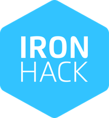

## 🧮 Github Stats

## 🖥 École 42 student

 

  
👋   Hello! I am Brian, currently based in Paris and in love with well crafted code. After 12 years in Specialty Coffee industry, from Toronto to Taipei, I embarqued in a new challenge: <a href="https://42.fr/">École 42</a>.

    
👨🏻‍💻   Spending two years learning code from scratch, I am now confident in C and C++, as well as some tools like Docker, k8s, bash scripting, git...

  
🚀   I recently decided to expand my skillset to web development, joining <a href="https://www.ironhack.com/">Ironhack bootcamp</a> for a deep dive in javascript, front and back end, noSql databases...

  

    
 

  
📂   My favorite projects at 42 were:

  <ul>
    <li>
      💥  <a href="https://github.com/42f/MINISHELL_42">Minishell</a>: We recreated a shell from scratch, with a minishell tester included, using only our own library (libft) and a limited range of external functions.
     </li>
    <li>
       💥  <a href="https://github.com/42f/WEBSERV">Webserve</a>: We reimplementated a minimalist HTTP/1.1 web server, based on nginx model.
     </li>
      <li>
       💥  <a href="https://github.com/42f/ft_transcendence">Ft_transcendence</a>: Full-stack application which allows user play pong game online and chat among each other.
     </li>
  </ul>
 
  

   

  
  

 
📂   My 3 main projects Ironhack were:

  <ul>
    <li>
      💥  <a href="https://pick-the-one.netlify.app/">Pick the one</a>: We recreated a fullstack website (MERN stack) which allow user to make log in and make groups of friends or family members in order to find a name for a coming baby. Some stats about first names for few countries are provided in a responsive website. Repos are: <a href="https://github.com/marcozampini/ironhack-final-project-front">Frontend repo</a> | <a href="https://github.com/marcozampini/ironhack-final-project-back">Backend repo</a>
     </li><li>
      💥  <a href="https://github.com/42f/IRONHACK_project_01">Spotimatch</a>: We recreated server-side-rendered website which allow users to log in, import some of their songs and playlists from Spotify, then make groups of friends and get a playlist made of common songs friends all like, this playlist can then be exported to any participant spotify account.
     </li>
    <li>
       💥  <a href="https://github.com/42f/IRONHACK_project_00">Memory Game</a>: This is my first solo project at Ironhack. It's a simple vanilla Js web page which allow user to play memory game base on card pairing. The cards set are designed to be easily implemented though class inheritence.
     </li>
  </ul>

  
## 📕 Projects Highlights

<h3> 📌 Assembly</h3>

     

<h3> 📌  C</h3>

    

    

    

    

    

    

  
⭐ Large project ⭐

    

<h3> 📌  C++</h3>

    

    

    

    

 
⭐ Large project ⭐

    

<h3> 📌  DevOp </h3>

    

    

<h3> 📌  WEB </h3>

    

